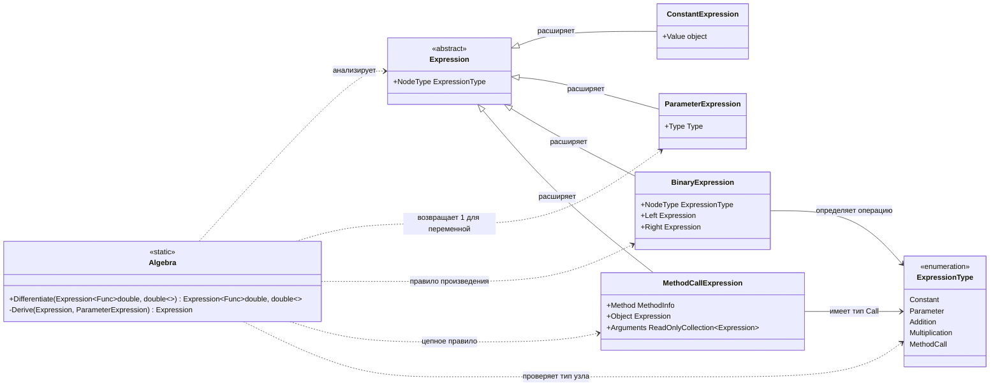

# Практика "Дифференцирование"

## Описание

Программа вычисляет производную функции одной переменной. На вход подаётся лямбда-выражение, преобразуемое в дерево узлов. Каждый узел обрабатывается по правилам математического анализа.

## Диаграмма классов

