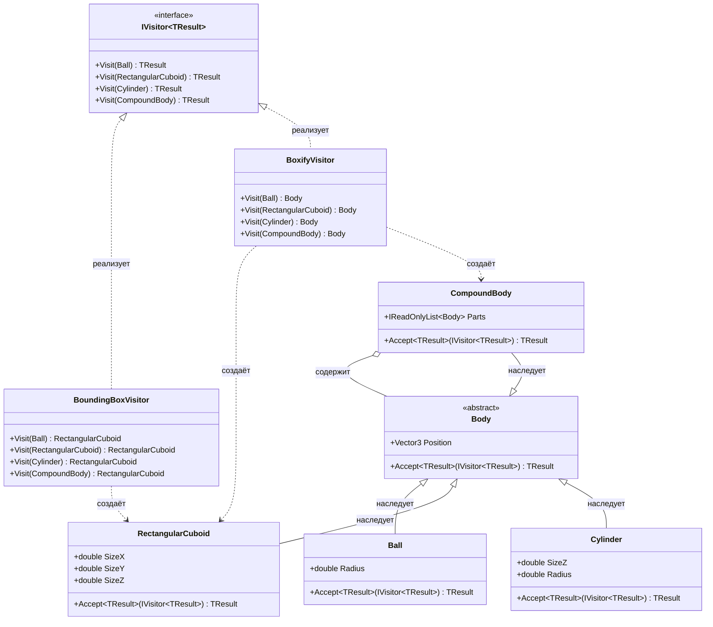

# Практика "Геометрия-2"

## Описание

Применён шаблон Visitor для добавления новых операций над  фигурами без изменения их классов. Реализован обобщённый интерфейс `IVisitor<TResult>` и два посетителя: `BoundingBoxVisitor` (вычисляет ограничивающий параллелепипед) и `BoxifyVisitor` (заменяет фигуры на их bounding boxes).

## Диаграмма классов

