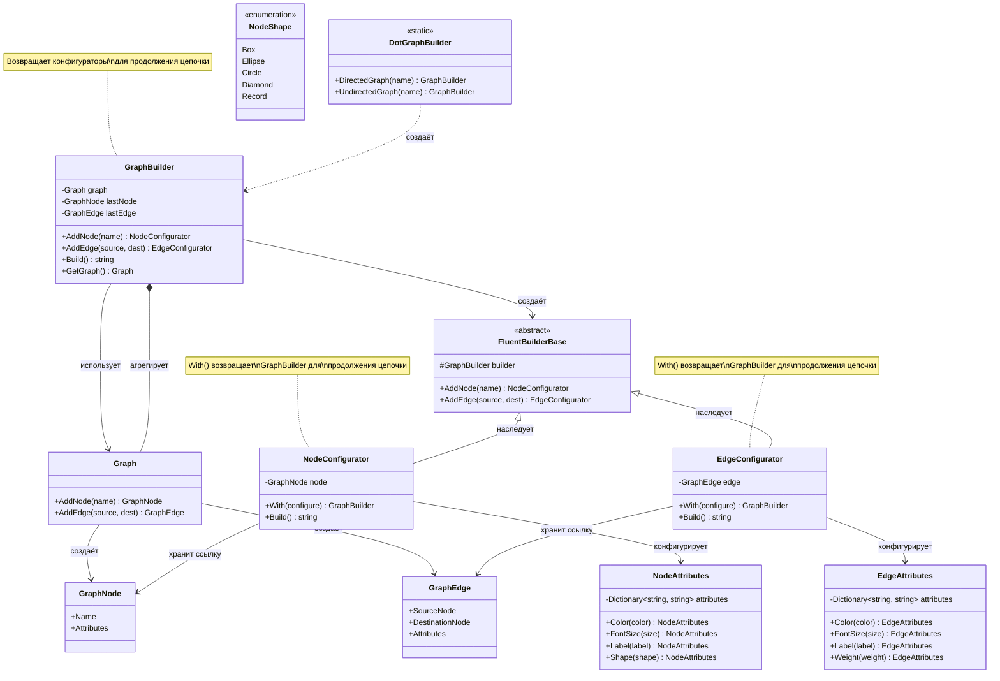

# Практика: GraphViz

## Описание решения

Реализован паттерн Builder с Fluent API для создания графов в формате DOT. Архитектура использует композицию вместо наследования: `GraphBuilder` управляет созданием графа, а конфигураторы (`NodeConfigurator`, `EdgeConfigurator`) отвечают за настройку атрибутов через метод `With()`. Неявные преобразования обеспечивают плавные переходы между состояниями цепочки вызовов.

## Диаграмма классов

