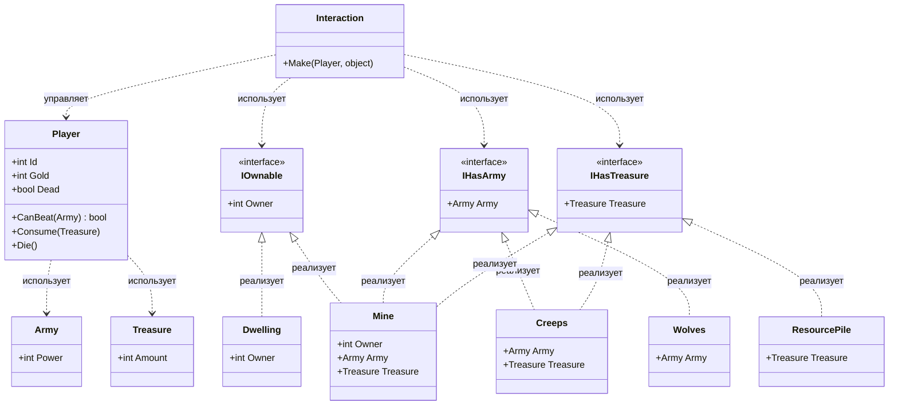

# Практика "HoMM"

## Описание предметной области

В игре персонаж взаимодействует с объектами на карте. Существуют три типа взаимодействия: сражение с армией, сбор сокровищ и захват объектов. Выделены интерфейсы: `IOwnable` (захватываемые объекты), `IHasArmy` (объекты с армией), `IHasTreasure` (объекты с сокровищами).

## Диаграмма классов

