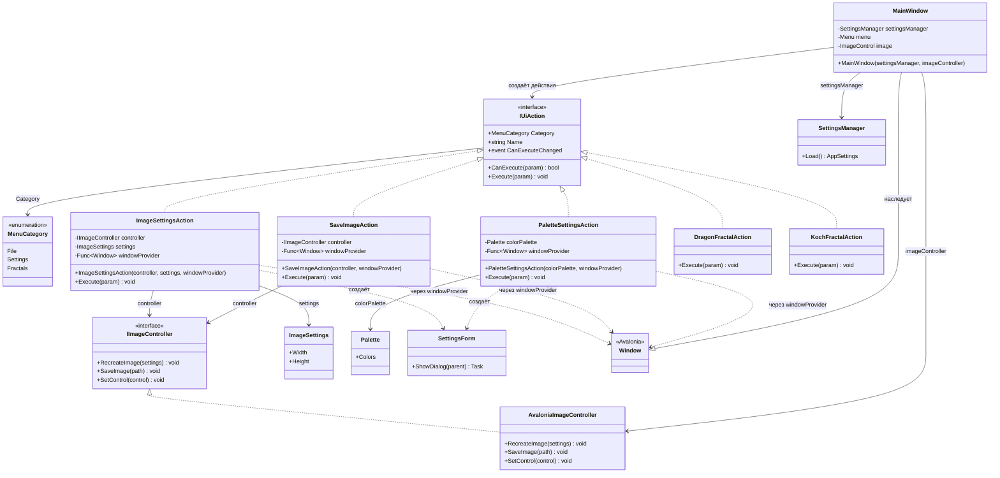

# Практика: Fractal Painter

## Описание решения

Проведён рефакторинг приложения для рисования фракталов с целью устранения зависимости от сервис-локатора `Services`. Классы действий (`ImageSettingsAction`, `SaveImageAction`, `PaletteSettingsAction`) теперь получают все зависимости через конструкторы, что соответствует принципу инверсии зависимостей (DIP). Используется паттерн Factory Method через `Func<Window>` для отложенного получения родительского окна.

## Диаграмма классов

