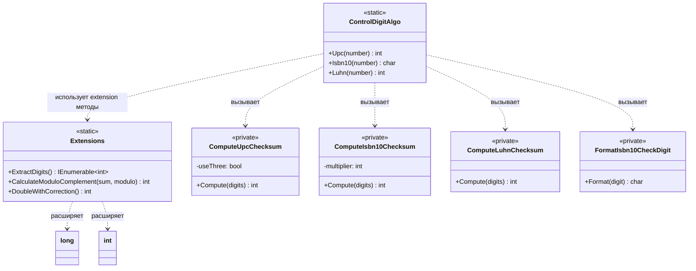

# Практика: Контрольный разряд

## Описание решения

Реализованы алгоритмы вычисления контрольного разряда (UPC, ISBN-10, Luhn) с применением принципа единственной ответственности. Общая логика вынесена в extension методы (`ExtractDigits`, `CalculateModuloComplement`, `DoubleWithCorrection`), а специфичная - в приватные методы вычисления контрольных сумм.

## Диаграмма классов

