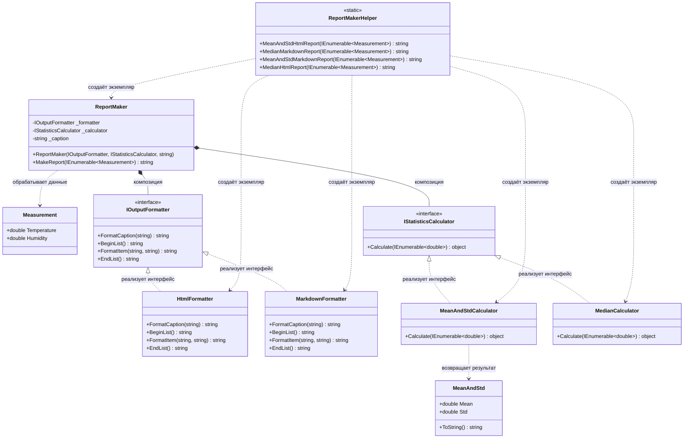

# Практика "Генератор отчетов"

## Описание предметной области

Вместо наследования применен паттерн делегирования через интерфейсы. Ответственность разделена на две части: форматирование вывода (HTML/Markdown) и вычисление статистических показателей (среднее с отклонением/медиана). Класс ReportMaker комбинирует форматтер и калькулятор для создания отчета.

## Диаграмма классов

