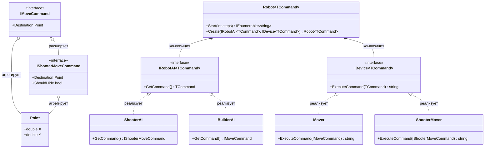

# Практика "Роботы"

## Описание

Применены дженерики с ковариацией и контрвариацией для создания архитектуры роботов. AI генерирует команды (ковариация `out`), Device выполняет команды (контрвариация `in`).

## Диаграмма классов

