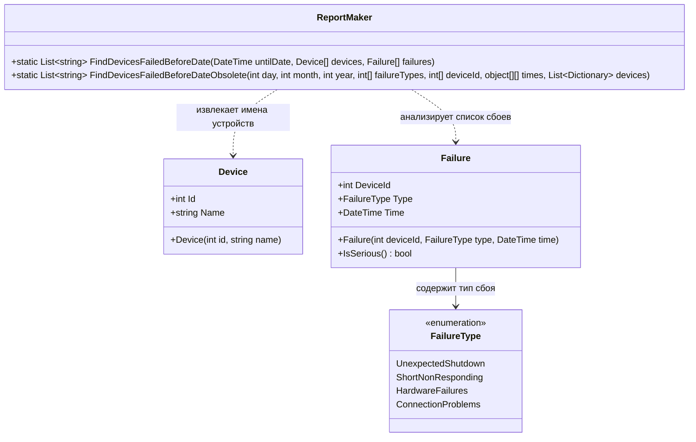

# Практика "Сбои"

## Описание предметной области

Система мониторинга устройств фиксирует сбои различных типов. Каждый сбой имеет тип, время возникновения и привязку к устройству. Сбои делятся на серьёзные (чётные типы) и несерьёзные (нечётные). Класс `ReportMaker` формирует отчёт об устройствах, имевших серьёзные сбои до указанной даты.

## Диаграмма классов

