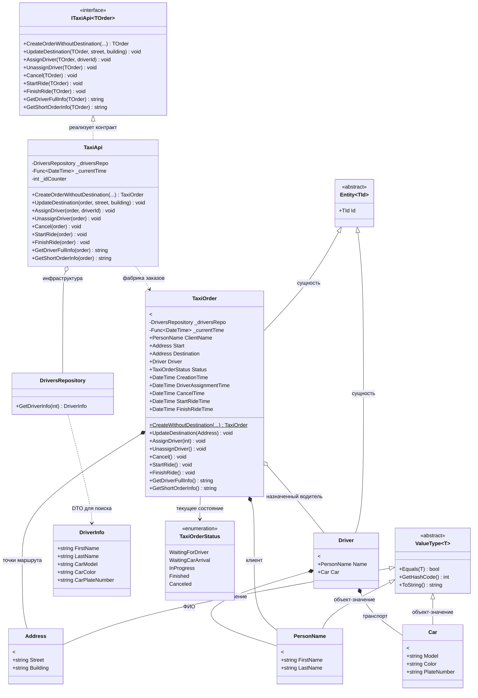

# Практика "TaxiOrder: Предметно-ориентированное проектирование"

## Описание предметной области

Система управления заказами такси, построенная на принципах DDD. 
Бизнес-логика инкапсулирована в доменных объектах, а технические 
детали вынесены в инфраструктурные компоненты. 
Агрегат `TaxiOrder` управляет жизненным циклом заказа, валидирует 
переходы состояний и координирует взаимодействие с водителем. 
Сервисный слой (`TaxiApi`) выступает тонкой прослойкой, 
делегирующей выполнение доменным моделям.

## Диаграмма классов

